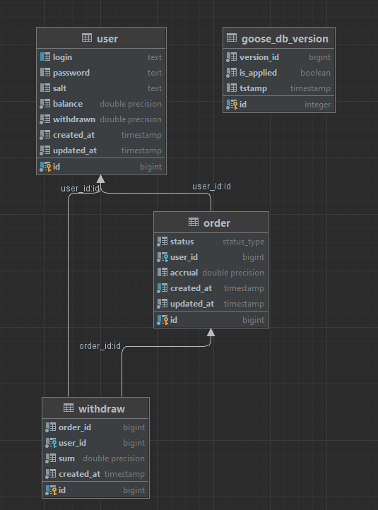
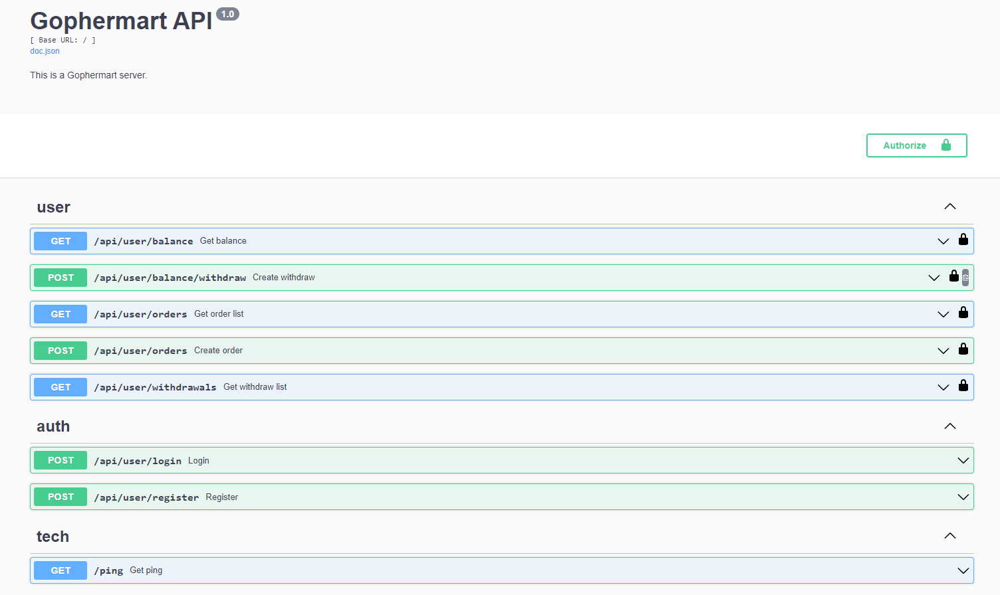

## Gophermart: Группа сервисов по начислению бонусов
---

### Описание сервиса
Сервис позволяет отслеживать и списывать бонусы, регистрировать заказы.

### Database scheme


### Swagger scheme


### Структура кода
- cmd/
    - accrual/accrual_linux_amd64 - запуск сервиса accrual
    - gophermart/main.go - запуск сервера с апи
- internal/
    - app/
        - gophermartapi  - server + интерфейсы к сервисам (авторизация, бизнес)
    - clients/
        - accrual/
            - models/ - модели
            - client.go - клиент
    - repo - data layer
        - migrations/ - миграции 
        - db.go - подключение к бд
        - models/ - модели бд
        - migrations_managment.go - набор методов для работы с миграциями
        - transact_managment.go - набор методов для работы с транзакциями
      - clients/
    - services/
        - auth/ - авторизация
        - business/ - бизнес
        - jobs/ - джобы

### Деплой и прочие нюансы
#### Руководство по запуску
##### Вариант запуска с помощью [docker](https://www.docker.com "популярный контейнизатор")

1. Запускаете команду из Makefile, которая поднимает все контейнеры из docker-compose и заходит в контейнер:

   ```make bash```
